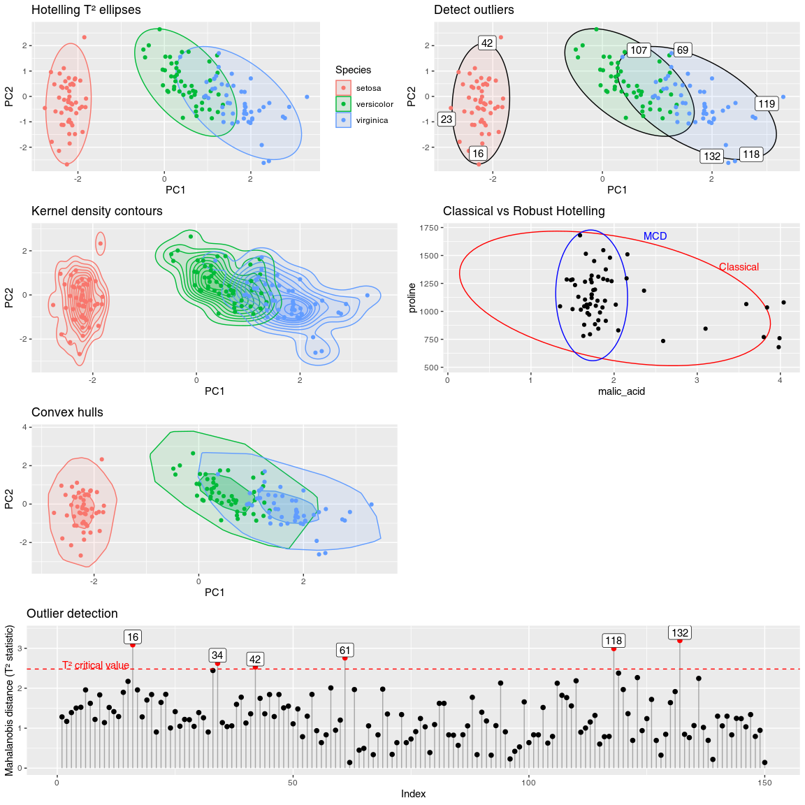

# Hotelling’s T² Ellipses and Outlier Detection for ggplot2 

<!-- badges: start -->

[](https://github.com/january3/gghotelling/actions/workflows/R-CMD-check.yaml)
[](https://app.codecov.io/gh/january3/gghotelling)
<!-- badges: end -->

Here are a few examples of plots you can create with `gghotelling`:



# Features:

- Classical Hotelling and data ellipses with `geom_hotelling()`
- Robust Hotelling ellipses using MCD estimator with `robust=TRUE`
- Hotelling confidence ellipses for group means with `type="t2mean"`
- Kernel density coverage contours with `geom_kde()`
- Outlier detection and visualization with `stat_outliers()`
- Convex hulls with `geom_hull()`
- Autoplot and autolayer methods for `prcomp` objects

See [the
vignette](https://january3.github.io/gghotelling/articles/gghotelling.html)
for more details.

## Installation

You can install the development version of gghotelling from
[GitHub](https://github.com/january3/gghotelling/) with:

``` r
# install.packages("pak")
pak::pak("january3/gghotelling")
```

## Minimal Example

The package defines a new geom, `geom_hotelling()`, which can be used to
add Hotelling ellipses to ggplot2 scatter plots.

``` r
library(ggplot2)
library(gghotelling)

pca <- prcomp(iris[, 1:4], scale.=TRUE)
df <- cbind(iris, pca$x)

# minimum example
p1 <- ggplot(df, aes(PC1, PC2, color=Species)) +
  geom_hotelling() +
  geom_point()

# set custom CI/coverage level
p2 <- ggplot(df, aes(PC1, PC2, color=Species)) +
  geom_hotelling(alpha=0.1, aes(fill = Species), level=.99) +
  geom_point()

plot_grid(p1, p2, ncol=2)
```


