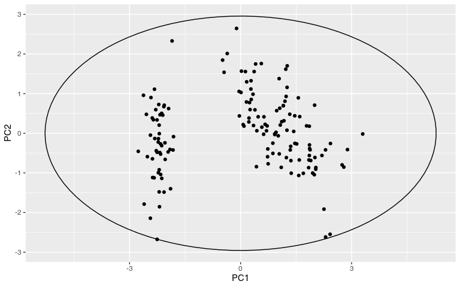

# Hotelling’s T² Ellipses and Outlier Detection for ggplot2 

<!-- badges: start -->

[](https://github.com/january3/gghotelling/actions/workflows/R-CMD-check.yaml)
[](https://app.codecov.io/gh/january3/gghotelling)
<!-- badges: end -->

Here are a few examples of plots you can create with `gghotelling`:

Hotelling data ellipses use the Hotelling T² distribution to create
coverage regions for the distribution of the data, often used in outlier
detection in multivariate data. This is different from the ellipses
returned by the `ellipse::ellipse()` or `car::dataEllipse()` functions,
which produce data ellipses based on a Mahalanobis distance contour,
representing the shape and spread of the data distribution.

This is also slightly different from the `stat_ellipse()` can be used to
create data ellipses (much like the ones from `ellipse::ellipse()`), and
also certain type of t ellipses. In contrast, gghotelling provides
explicit Hotelling T² data ellipses and Hotelling T² confidence
ellipses, with a clear distinction between the two.

Unlike stat_ellipse(), it can also take the `fill` aesthetic for a
visually pleasing representation of the ellipses.

A lot of functionality overlaps with `ggfortify::ggbiplot()` (and by
extension `autoplot.pca_class`), but this function is less flexible than
a separate geom that you can add to the figure.

Moreover, the package provides a `stat_outliers()` function to compute
the per-point Hotelling T² statistics, which can be used to identify and
visualize multivariate outliers in scatter plots.

My main motivation for creating this package was sorting out the
different ellipse types and allowing the use of `fill` aesthetics for
Hotelling ellipses.

## Installation

You can install the development version of gghotelling from
[GitHub](https://github.com/) with:

``` r
# install.packages("pak")
pak::pak("january3/gghotelling")
```

## Minimal Example

The package defines a new geom, `geom_hotelling()`, which can be used to
add Hotelling ellipses to ggplot2 scatter plots.

``` r
library(ggplot2)
library(gghotelling)
library(cowplot)

pca <- prcomp(iris[, 1:4], scale.=TRUE)
df <- cbind(iris, pca$x)

p1 <- ggplot(df, aes(PC1, PC2, color=Species)) +
  geom_hotelling() +
  geom_point()

# set custom CI/coverage level
p2 <- ggplot(df, aes(PC1, PC2, color=Species)) +
  geom_hotelling(alpha=0.1, aes(fill = Species), level=.99) +
  geom_point()

plot_grid(p1, p2, ncol=2)
```



Other features:

- Robust Hotelling ellipses using MCD estimator
- Hotelling confidence ellipses for group means
- Kernel density coverage contours with `geom_kde()`
- Outlier detection and visualization with `stat_outliers()`
- Convex hulls with `geom_hull()`
- Autoplot method for `prcomp` objects

See [the vignette](https://january3.github.io/gghotelling/) for more
details.
