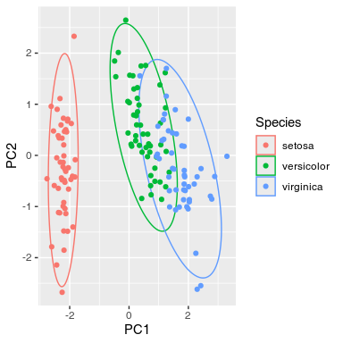
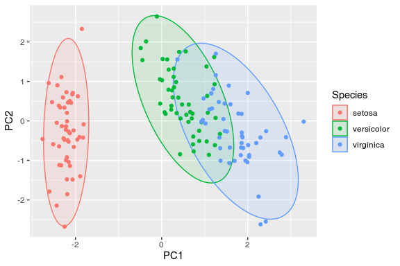

# gghotelling

<!-- badges: start -->

[](https://github.com/january3/gghotelling/actions/workflows/R-CMD-check.yaml)
[](https://app.codecov.io/gh/january3/gghotelling)
<!-- badges: end -->

Show Hotelling T² ellipses with ggplot2.

Hotelling data ellipses are using the Hotelling T² distribution to
create coverage regions for the distribution of the data, often used in
outlier detection in multivariate data. This is different from the
ellipses returned by the `ellipse::ellipse()` or `car::dataEllipse()`
functions, which produce data ellipses based on a χ² (chi-square)
contour, representing the shape and spread of the data distribution.

This is also slightly different from the `stat_ellipse()` can be used to
create data ellipses (much like the ones from `ellipse::ellipse()`), and
also Hotelling data (?) ellipses. Unlike stat_ellipse(), it can also
take the `fill` aesthetic for a visually pleasing representation of the
ellipses.

## Installation

You can install the development version of gghotelling from
[GitHub](https://github.com/) with:

``` r
# install.packages("pak")
pak::pak("january3/gghotelling")
```

## Example

The package defines a new geom, `geom_hotelling()`, which can be used to
add Hotelling ellipses to ggplot2 scatter plots.

``` r
library(ggplot2)
library(gghotelling)

pca <- prcomp(iris[, 1:4], scale.=TRUE)
df <- cbind(iris, pca$x)

ggplot(df, aes(PC1, PC2)) +
  geom_hotelling(ci=.99) +
  geom_point()
#> computing normal
```


``` r

ggplot(df, aes(PC1, PC2, color=Species)) +
  geom_hotelling() +
  geom_point()
#> computing normal
#> computing normal
#> computing normal
```



``` r

ggplot(df, aes(PC1, PC2, color=Species)) +
  geom_hotelling(alpha=0.1, aes(fill = Species)) +
  geom_point()
#> computing normal
#> computing normal
#> computing normal
```


