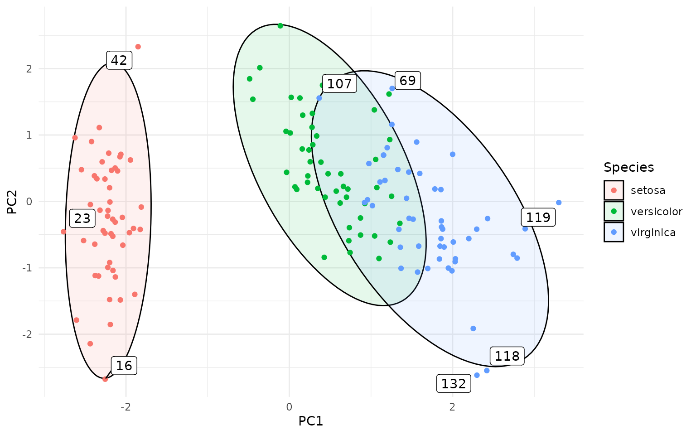

# Hotelling ellipses, contours and outliers

``` r
library(ggplot2)
library(gghotelling)

theme_set(theme_minimal())
```

## Hotelling’s T² Ellipses and Outlier Detection for ggplot2 

Hotelling data ellipses use the Hotelling T² distribution to create
coverage regions for the distribution of the data, often used in outlier
detection in multivariate data. This is different from the ellipses
returned by the
[`ellipse::ellipse()`](https://dmurdoch.github.io/ellipse/reference/ellipse.html)
or `car::dataEllipse()` functions, which produce data ellipses based on
a Mahalanobis distance contour, representing the shape and spread of the
data distribution.

This is also slightly different from the
[`stat_ellipse()`](https://ggplot2.tidyverse.org/reference/stat_ellipse.html)
can be used to create data ellipses (much like the ones from
[`ellipse::ellipse()`](https://dmurdoch.github.io/ellipse/reference/ellipse.html)),
and also certain type of t ellipses. In contrast, gghotelling provides
explicit Hotelling T² data ellipses and Hotelling T² confidence
ellipses, with a clear distinction between the two.

Unlike stat_ellipse(), it can also take the `fill` aesthetic for a
visually pleasing representation of the ellipses.

A lot of functionality overlaps with `ggfortify::ggbiplot()` (and by
extension `autoplot.pca_class`), but this function is less flexible than
a separate geom that you can add to the figure.

Moreover, the package provides a
[`stat_outliers()`](https://january3.github.io/gghotelling/reference/stat_outliers.md)
function to compute the per-point Hotelling T² statistics, which can be
used to identify and visualize multivariate outliers in scatter plots.

My main motivation for creating this package was sorting out the
different ellipse types and allowing the use of `fill` aesthetics for
Hotelling ellipses. I tried to make the usage convenient, simple and
intuitive.

### Installation

You can install the development version of gghotelling from
[GitHub](https://github.com/) with:

``` r
# install.packages("pak")
pak::pak("january3/gghotelling")
```

### Hotelling Ellipses

The package defines a new geom,
[`geom_hotelling()`](https://january3.github.io/gghotelling/reference/geom_hotelling.md),
which can be used to add Hotelling ellipses to ggplot2 scatter plots.

``` r
library(ggplot2)
library(gghotelling)

pca <- prcomp(iris[, 1:4], scale.=TRUE)
pca_df <- cbind(iris, pca$x)

ggplot(pca_df, aes(PC1, PC2)) +
  geom_hotelling(level=.99) +
  geom_point()
```


``` r

ggplot(pca_df, aes(PC1, PC2, color=Species)) +
  geom_hotelling() +
  geom_point()
```


``` r

ggplot(pca_df, aes(PC1, PC2, color=Species)) +
  geom_hotelling(alpha=0.1, aes(fill = Species)) +
  geom_point()
```


``` r

# set custom CI/coverage level
ggplot(pca_df, aes(PC1, PC2, color=Species)) +
  geom_hotelling(alpha=0.1, aes(fill = Species), level=.99) +
  geom_point()
```


The package also provides per-point, group-wise T² statistics which can
be used to identify multivariate outliers.

``` r
ggplot(pca_df, aes(PC1, PC2, group=Species)) +
  geom_hotelling(level = 0.75, alpha=0.1, aes(fill = Species)) +
  scale_color_manual(values=c("TRUE"="red", "FALSE"="grey")) +
  stat_outliers(level = .75, aes(shape = Species, color = after_stat(is_outlier)))
```


``` r

ggplot(pca_df, aes(PC1, PC2, group=Species)) +
  geom_hotelling(alpha=0.1, aes(fill = Species)) +
  stat_outliers(size=2, aes(shape = Species, color = after_stat(t2)))
```


This can be useful for identifying potential outliers in multivariate
data. The outliers can be directly labeled as follows:

``` r
ggplot(pca_df, aes(PC1, PC2, group=Species, label=rownames(pca_df))) +
  geom_hotelling(alpha=0.1, aes(fill = Species)) +
  geom_point(aes(color = Species)) +
  stat_outliers(geom="label", 
                        outlier_only = TRUE)
```


``` r

# or even with geom_label_repel from ggrepel
library(ggrepel)
ggplot(pca_df, aes(PC1, PC2, group=Species, label=rownames(pca_df))) +
  geom_hotelling(alpha=0.1, aes(fill = Species)) +
  geom_point(aes(color = Species)) +
  stat_outliers(geom="label_repel",
                        outlier_only = TRUE)
```



### Robust Hotelling Ellipses

Robust Hotelling ellipses can be created by setting the `robust=TRUE`
argument in
[`geom_hotelling()`](https://january3.github.io/gghotelling/reference/geom_hotelling.md)
or
[`stat_outliers()`](https://january3.github.io/gghotelling/reference/stat_outliers.md).
This uses the Minimum Covariance Determinant (MCD) estimator from the
`robustbase` package to compute robust estimates of the mean and
covariance matrix, which are then used to compute the Hotelling or
chi-squared data ellipses.

Robust ellipses are less sensitive to outliers and can provide a more
accurate representation of the data distribution when outliers are
present. Below I am showing a comparison between classical and robust
Hotelling ellipses in the presence of outliers. The data set used,
`wine`, contains chemical analysis of various wines, with several
obvious outliers, and the figure recapitulates the figure 1 from a paper
by Hubert et al. (Hubert, Debruyne, and Rousseeuw 2018).

``` r
library(HDclassif)
#> Loading required package: MASS
data(wine)
wine <- wine[ wine$class == 1, ]
wine <- data.frame("malic_acid"=wine$V2, "proline"=wine$V13)

ggplot(wine, aes(malic_acid, proline)) +
  geom_hotelling(type="data", level = .975, color = "red") +
  geom_hotelling(type="data", level = .975, robust = TRUE, color = "blue") +
  geom_point() +
  annotate("text", x=2.5, y = 1675, label = "MCD", color = "blue") +
  annotate("text", x=3.5, y = 1400, label = "Classical", color = "red")
```


### Convex Hulls and contours

The package provides basic convex hull:

``` r
ggplot(iris, aes(Sepal.Length, Sepal.Width, color=Species)) +
  geom_hull(mapping = aes(fill = Species), alpha=.1) +
  geom_point()
```


Furthermore, we also have
[`geom_kde()`](https://january3.github.io/gghotelling/reference/geom_kde.md)
to draw 2D kernel density estimate. Unlike
[`geom_density_2d()`](https://ggplot2.tidyverse.org/reference/geom_density_2d.html),
this function actually creates a single contour for the specified
coverage; for example, if `coverage=0.95`, the contour encloses roughly
95% of the data points. This is useful for visualizing the density
distribution of non-elliptical data:

``` r
df <- data.frame(x=rnorm(500) + 5)
df$y <- df$x^5 + rnorm(500)*500
ggplot(df, aes(x=x, y=y)) +
  geom_point()+
  geom_hull(color = "grey") +
  geom_kde(color="red", size=1)
#> Warning: Using `size` aesthetic for lines was deprecated in ggplot2 3.4.0.
#> ℹ Please use `linewidth` instead.
#> This warning is displayed once every 8 hours.
#> Call `lifecycle::last_lifecycle_warnings()` to see where this warning was
#> generated.
```


As you can see, the
[`geom_kde()`](https://january3.github.io/gghotelling/reference/geom_kde.md)
contour nicely captures the non-elliptical distribution of the data,
while the convex hull includes a large empty area.

Of course, you can also use aesthetics like `fill` with
[`geom_kde()`](https://january3.github.io/gghotelling/reference/geom_kde.md)
and overlay several contours:

``` r
# interesting little fact: ggplot2 happily accepts lists of geoms/layers
# and adds them one by one to the plot

rings <- lapply(seq(.05, .95, length.out = 10), \(i) {
  geom_kde(aes(fill = Species), alpha =.05, coverage = i)
})

ggplot(pca_df, aes(x = PC1, y = PC2, color=Species)) +
  rings +
  geom_point()
```


### Autoplot

The package also defines `autoplot.prcomp` and `autolayer.prcomp` for
convenient plotting of PCA plots. Note that `autoplot.prcomp` is also
implemented in a more sophisticated way in the `ggfortify` package.

``` r
autoplot(pca, group = iris$Species) + 
  autolayer(pca, group = iris$Species)
```


Hubert, Mia, Michiel Debruyne, and Peter J Rousseeuw. 2018. “Minimum
Covariance Determinant and Extensions.” *Wiley Interdisciplinary
Reviews: Computational Statistics* 10 (3): e1421.
